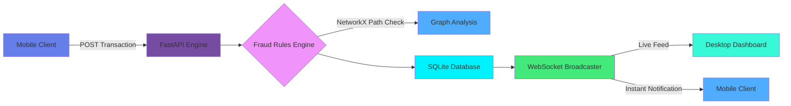
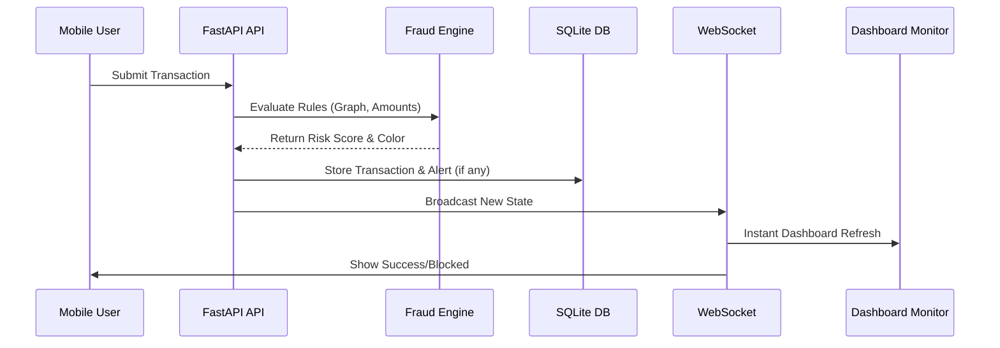

# 🛡️ SentinelBank

<div align="center">

**Real-Time Bank Transaction Simulator & Fraud Detection Engine**

[](https://opensource.org/licenses/MIT)
[](https://www.python.org/downloads/)
[](https://fastapi.tiangolo.com/)
[](https://reactjs.org/)
[](https://www.sqlite.org/index.html)
[](#)
[](https://github.com/sangsaist/SentinelBank/pulls)

[Features](#-features) • [Quick Start](#-quick-start) • [Architecture](#-system-architecture) • [Contributing](#-contributing)

</div>

---

## 📖 Table of Contents

- [Overview](#-overview)
- [The Problem](#-the-problem)
- [Our Solution](#-our-solution)
- [Key Features](#-features)
- [System Architecture](#-system-architecture)
- [Technology Stack](#-technology-stack)
- [Quick Start](#-quick-start)
- [Demo Script](#-demo-script)
- [API Documentation](#-api-documentation)
- [Roadmap](#-roadmap)
- [Contributing](#-contributing)
- [License](#-license)

---

## 🌟 Overview

**SentinelBank** is a real-time bank transaction simulator featuring a live **rule-based fraud detection engine**. Engineered for instantaneous risk scoring and monitoring, the system evaluates and classifies live transactions into **Safe (green)**, **Suspicious (orange)**, or **Fraud (red)** categories, updating connected clients instantly over WebSockets.

### 🎯 Mission

Provide a dynamic, interactive demonstration of real-time fraud analysis, moving beyond static spreadsheets to visualize how complex patterns like circular transactions and chain layering can be detected and mitigated instantly.

### 🏛️ Deployment Model

- **Desktop Dashboard (`/`)**: A monitoring center for tracking live events, fraud alerts, and engine telemetry.
- **Mobile Bank App (`/mobile`)**: A client interface simulating user transfers and real-time push notifications.
- **Background Engine**: A self-driving simulation core delivering autonomous transaction volume.

---

## 💡 The Problem

Traditional fraud monitoring often relies on delayed, batch-processed transaction analysis, leading to critical visibility gaps:

<table>
<tr>
<td width="50%">

### ❌ **Current State**
- ✗ Batch processed anti-fraud checks
- ✗ Delayed response to ongoing attacks
- ✗ Static, non-visual dashboards
- ✗ Difficult to simulate attack vectors
- ✗ High latency between event and alert

</td>
<td width="50%">

### ✅ **With SentinelBank**
- ✓ Millisecond-latency transaction scoring
- ✓ Instantaneous WebSocket data broadcast
- ✓ Visual graph-based layout of fraud rules
- ✓ One-click attack vector injection
- ✓ Unified view across all network nodes

</td>
</tr>
</table>

---

## 🚀 Our Solution

### **Real-Time Event Architecture**



### **Core Philosophy**

> **Every transaction is an active event.**  
> The rule engine evaluates immediately.  
> The dashboard visualizes instantaneously.  

By maintaining robust real-time synchronization, the platform ensures that system operators and account holders share a unified, immediate truth state.

---

## ✨ Features

<div align="center">

| 🔄 Real-time Sync | 🛡️ Fraud Engine | 📊 Live Dashboard | 📱 Mobile Client |
|:-----------------:|:----------------:|:-----------------:|:----------------:|
| WebSocket Data | NetworkX Graph | Transaction Feed | Seeded Accounts |
| Live Reconnection | Value Thresholds | System Analytics | Instant Alerts |
| Sub-second Update | Multi-rule Scoring | Alert Feed | Block Visiblity |

</div>

### 🕵️ **For Monitoring Operators (Desktop)**
- 📈 View live, streaming transaction feeds in real-time.
- 🚨 Receive immediate, color-coded Fraud Alerts.
- 🎯 Inject demo fraud scenarios (e.g., Circular, Layering, Burst) on demand.
- ⚙️ Control the background transaction generator (Start/Pause/Stop).

### 💳 **For Account Holders (Mobile)**
- 💸 Quickly select seeded demo accounts and execute transfers.
- 💰 Instantly receive incoming-payment notification banners.
- 🛑 Experience instant transaction blocking upon triggering a fraud rule.

---

## 🏗️ System Architecture

### **High-Level Architecture**

```text
┌─────────────────────────────────────────────────────────────┐
│                    Client Interfaces (React)                 │
│    Desktop Dashboard (Monitor)  •  Mobile App (Accounts)     │
└────────────────────────┬───────────────────────────▲────────┘
             HTTP REST   │                           │ WebSockets
┌────────────────────────▼───────────────────────────┴────────┐
│                   Application Layer (FastAPI)                │
│  ┌────────────┬─────────────┬─────────────┬──────────────┐  │
│  │    API     │ Fraud Core  │ Auto Engine │  WS Manager  │  │
│  └────────────┴─────────────┴─────────────┴──────────────┘  │
└────────────────────────┬────────────────────────────────────┘
                         │ SQLAlchemy ORM
┌────────────────────────▼────────────────────────────────────┐
│                  Database Layer (SQLite)                     │
│               Accounts • Transactions • Alerts               │
└─────────────────────────────────────────────────────────────┘
```

### **Event Data Flow (Sequence)**



---

## 🛠️ Technology Stack

<div align="center">

### **Backend**


### **Frontend**


</div>

| Component | Technology | Purpose |
|-----------|-----------|---------|
| **Core API** | Python + FastAPI | High-performance asynchronous API & WebSocket server |
| **Storage** | SQLite + SQLAlchemy | Persistence for accounts and transactions |
| **Logic** | NetworkX | Graph theory module for calculating circular transaction paths |
| **UI Engine** | React + Vite | Real-time interactive user interfaces |
| **Styling** | Tailwind CSS | Utility-driven UI rendering |
| **State** | Zustand | Managing live transaction streams frontend-side |

---

## 🚀 Quick Start

### **Prerequisites**
- **Python 3.11+**
- **Node.js 18+**
- **Git**

### **Installation in 4 Steps**

**Step 1. Clone the repository**
```bash
git clone https://github.com/sangsaist/SentinelBank.git
cd SentinelBank
git checkout dev
```

**Step 2. Start the Backend**
```bash
cd backend
pip install -r requirements.txt
uvicorn main:app --host 0.0.0.0 --port 8000 --reload
```

**Step 3. Configure Frontend Environment**
Create `.env` inside the `frontend` directory using your Wi-Fi LAN IP address instead of localhost (vital for mobile device connectivity):
```env
# In frontend/.env
VITE_API_URL=http://YOUR_LAN_IP:8000
VITE_WS_URL=ws://YOUR_LAN_IP:8000/ws
```

**Step 4. Start the Frontend**
```bash
cd frontend
npm install
npm run dev
```

### Access Ports
- **Desktop System Dashboard:** `http://localhost:5173`
- **Mobile Simulator App:** `http://YOUR_LAN_IP:5173/mobile` (Access on your phone)

---

## 🎭 Demo Script

1. **Dashboard:** Open `http://localhost:5173` on a desktop.
2. **Mobile Clients:** Have team members open `http://YOUR_LAN_IP:5173/mobile` on their smartphones.
3. **Simulate Background Noise:** Click the **Start (▶️)** button on the dashboard to enable the autonomous transaction engine.
4. **Trigger Fraud:** On a mobile client, log into Account **A** and transfer **₹95,000** to Account **B**.
   - Watch the desktop dashboard instantly flash a **RED Alert** (`HIGH_VALUE_TRANSFER`).
   - The mobile client immediately receives a **Blocked** status.
5. **Trigger Safe Txn:** Send **₹500** from **A** to **B**.
   - Dashboard logs a **GREEN (Safe)** transaction.
   - User B's phone displays a real-time **💰 Money Received** banner.
6. **Inject Attacks:** Use the dashboard's `Fraud Queue Builder` to simulate **Layering**, **Smurfing**, or **Circular** bypass attempts.

---

## 📚 API Documentation

### **REST Endpoints**

| Method | Endpoint | Description |
|--------|----------|-------------|
| `GET` | `/transactions` | Fetch latest historical transactions. |
| `GET` | `/fraud-alerts` | Fetch queued history of fraud detections. |
| `POST` | `/transaction` | Process a new transfer and run anti-fraud heuristics. |
| `POST` | `/engine/start` | Ignite continuous background data simulator. |
| `POST` | `/inject/{id}` | Inject specific attack vectors (Rapid Burst, Circular, etc). |

<details>
<summary><strong>📖 View Transaction JSON Structure</strong></summary>

**Submit Transaction:**
```bash
curl -X POST http://localhost:8000/transaction \
  -H "Content-Type: application/json" \
  -d '{
    "sender_id": "A",
    "receiver_id": "B",
    "amount": 50000
  }'
```

**WebSocket Live Broadcast Response:**
```json
{
  "type": "transaction",
  "data": {
    "transaction_id": "f5a7d23a",
    "sender_id": "A",
    "receiver_id": "B",
    "amount": 50000,
    "timestamp": "2026-03-14T10:00:00.000000+00:00",
    "is_fraud": 0,
    "risk_score": 0.45,
    "color": "orange",
    "fraud_reason": "UNUSUAL_AMOUNT"
  }
}
```
</details>

---

## 🗺️ Roadmap

- [x] WebSockets for sub-second system observability
- [x] NetworkX based multi-node loop mapping
- [x] Injection tooling for mock-attack demos
- [ ] Migrate SQLite logic natively to PostgreSQL for deep-scale benchmarking
- [ ] Incorporate Machine Learning heuristic models alongside hardcoded rules 
- [ ] Integrate React-Native framework structure for actual App Store simulation

---

## 📁 Project Structure

```text
SentinelBank/
├── backend/
│   ├── app/
│   │   ├── api/            # REST endpoint logic 
│   │   ├── core/           # Fraud detection engine, scenario injector
│   │   ├── db/             # Schema models & data seeders
│   │   ├── schemas/        # Request/Response data contracts
│   │   └── websocket/      # Live channel distributors
│   ├── main.py             # Server boot configuration
│   └── requirements.txt
├── frontend/
│   ├── src/
│   │   ├── api/            # Axial API clients
│   │   ├── components/     # Visual elements (StatsBar, FraudAlertFeed, etc.)
│   │   ├── hooks/          # Real-time WebSocket hook definitions
│   │   ├── pages/          # Layout routing endpoints (/ and /mobile)
│   │   └── store/          # Zustand memory cache parameters
│   └── package.json
└── README.md
```

---

## 🤝 Contributing

Contributions are heavily encouraged for the advancement of real-time monitoring strategies!

1. **Fork** the repository.
2. **Create** a feature branch: `git checkout -b feature/enhanced-engine`
3. **Commit** your progress: `git commit -m 'feat: Add parallel scanning queue'`
4. **Push** into the branch: `git push origin feature/enhanced-engine`
5. **Open** a Pull Request against `dev`.

---

## 📄 License

This repository is distributed under the **MIT License**. Check the [LICENSE](LICENSE) file for additional terms.

---

<div align="center">

### **Built for Precision**

**Visualizing complex cyber-financial telemetry before it settles.**

[⬆ Back to Top](#-sentinelbank)

</div>